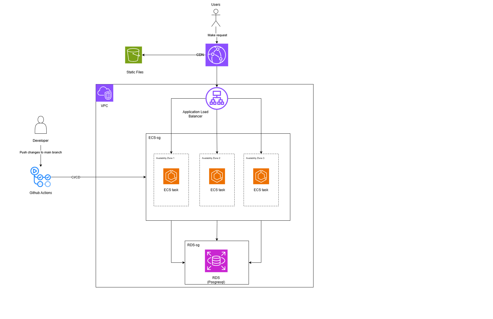

# Inventory Management System

A multi-tenant inventory management platform built with FastAPI (backend), React + Vite (frontend), PostgreSQL, and Docker.

## Architecture



## Features

- JWT-based authentication and authorization
- Multi-tenant data separation
- Product and category management
- Warehouse and stock tracking
- Inventory transactions (In, Out, Transfer)
- Dashboard and reporting endpoints
- Dockerized local and production-ready setup
- CI/CD deployment to Amazon ECS (Fargate)

## Tech Stack

- Backend: FastAPI, asyncpg, Pydantic
- Frontend: React, TypeScript, Vite
- Database: PostgreSQL
- Containers: Docker, Docker Compose
- Cloud: Amazon ECR, ECS Fargate, CloudWatch Logs
- CI/CD: GitHub Actions

## Project Structure

```text
.
├── src/
│   ├── api/              # FastAPI route modules
│   ├── core/             # Shared dependencies and connection helpers
│   ├── db/               # SQL scripts and db pool utilities
│   ├── models/           # Domain models
│   ├── repositories/     # Data access layer
│   ├── schemas/          # Request/response schemas
│   ├── services/         # Business logic layer
│   └── main.py
├── tests/                # Backend test suite
├── ui/app/               # React frontend app
├── .aws/task-definition.json
├── .github/workflows/ci-cd.yaml
├── docker-compose.yml
├── docker-compose.dev.yml
├── Dockerfile
└── requirements.txt
```

## API Route Groups

- `/api/auth`
- `/api/dashboard`
- `/api/products`
- `/api/categories`
- `/api/warehouses`
- `/api/transactions`
- `/api/users`

## Prerequisites

- Python 3.11+
- Node.js 18+
- Docker and Docker Compose
- PostgreSQL (if running backend without Docker)

## Environment Variables

Create a `.env` file in the project root.

```env
DB_HOST=localhost
DB_PORT=5432
DB_NAME=inventory
DB_USER=postgres
DB_PASSWORD=postgres

SECRET_KEY=change-me
ALGORITHM=HS256
ACCESS_TOKEN_EXPIRE_MINUTES=30

CORS_ORIGINS=http://localhost:5173,http://localhost:3000,http://localhost
VITE_API_BASE_URL=http://localhost:8000
```

## Run Locally (Without Docker)

### 1) Backend

```bash
python -m venv .venv
# Windows PowerShell
.\.venv\Scripts\Activate.ps1
# macOS/Linux
# source .venv/bin/activate

pip install -r requirements.txt
uvicorn main:app --app-dir src --reload --host 0.0.0.0 --port 8000
```

Backend URLs:

- API: http://localhost:8000
- Swagger docs: http://localhost:8000/docs
- ReDoc: http://localhost:8000/redoc

### 2) Frontend

```bash
cd ui/app
npm install
npm run dev
```

Frontend URL:

- App: http://localhost:5173

## Run With Docker

### Development Mode

Use hot-reload for backend and frontend:

```bash
docker compose -f docker-compose.yml -f docker-compose.dev.yml up --build
```

### Production-like Mode

```bash
docker compose up --build -d
```

Default ports:

- Frontend (nginx): http://localhost
- Backend (internal in compose): 8000

## Testing

Run backend tests:

```bash
pytest tests/ -v
```

Pytest config is defined in `pytest.ini`.

## Database

- Database schema is available in `src/db/create.sql`.
- The app uses an async PostgreSQL connection pool during startup.

## CI/CD (GitHub Actions -> ECS)

Workflow file: `.github/workflows/ci-cd.yaml`

Pipeline on push to `main`:

1. Run backend tests with pytest
2. Build Docker image
3. Push image to Amazon ECR
4. Render ECS task definition with new image
5. Deploy updated task definition to ECS service

Task definition file: `.aws/task-definition.json`

### Required GitHub Secrets

Set these in your repository settings:

- `AWS_ACCESS_KEY_ID`
- `AWS_SECRET_ACCESS_KEY`

## Deployment Notes

- ECS container listens on port 8000.
- Health check calls `/` on localhost:8000.
- `SECRET_KEY` and `DB_PASSWORD` are injected via AWS Secrets Manager in task definition.

## Common Commands

```bash
# Run tests
pytest tests/ -v

# Run backend in dev mode
uvicorn main:app --app-dir src --reload --host 0.0.0.0 --port 8000

# Build backend image
docker build -t inventory-backend .
```

